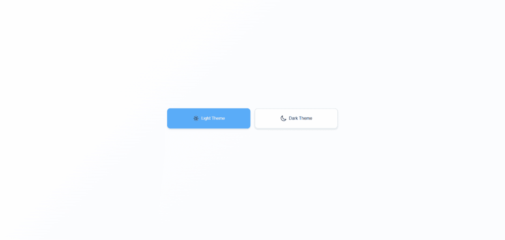
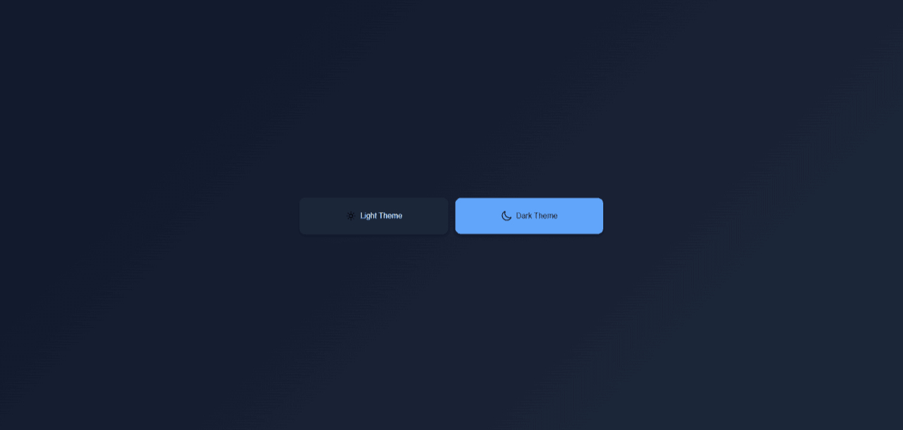

## Screenshots

### Light Theme



### Dark Theme



# React Light/Dark Mode Theme Switcher

React application that allows users to switch between light and dark themes.

## Technologies Used

- **React** - UI library
- **TypeScript** - Type-safe JavaScript
- **Vite** - Fast build tool and development server
- **CSS** - Modern styling with custom properties and animations

## Getting Started

### Prerequisites

- Node.js (version 16 or higher)
- npm

### Installation

1. Clone the repository:

```bash
git clone <repository-url>
cd reactLightDarkMode
```

2. Install dependencies:

```bash
npm install
```

3. Start the development server:

```bash
npm run dev
```

4. Open your browser and navigate to `http://localhost:5173`

### Available Scripts

- `npm run dev` - Start development server
- `npm run build` - Build for production
- `npm run preview` - Preview production build
- `npm run lint` - Run ESLint

## Project Structure

```
src/
├── assets/          # Static assets (icons, images)
├── App.tsx          # Main application component
├── App.css          # Application styles
├── index.css        # Global styles
└── main.tsx         # Application entry point
```

## Screenshots

### Light Theme


### Dark Theme


### How to Add Images to README

To add images to your README.md file:

1. **Create a screenshots folder** in your project root:

```bash
mkdir screenshots
```

2. **Add your images** to the screenshots folder (PNG, JPG, GIF formats work best)

3. **Reference images in markdown** using this syntax:

```markdown

```

4. **For GitHub repositories**, you can also use absolute URLs:

```markdown

```

**Tips for README images:**

- Use descriptive alt text for accessibility
- Keep image files reasonably sized (under 2MB)
- Use PNG for screenshots with text, JPG for photos
- Maintain consistent aspect ratios
- Consider creating a `docs/` or `assets/` folder for organization

## Usage

Click on either the "Light Theme" or "Dark Theme" button to switch between color schemes. The active theme will be highlighted, and smooth transitions will animate the change.

## Customization

The theme colors are defined using CSS custom properties in `App.css`. You can easily modify the color scheme by updating the CSS variables in the `:root` selector.
